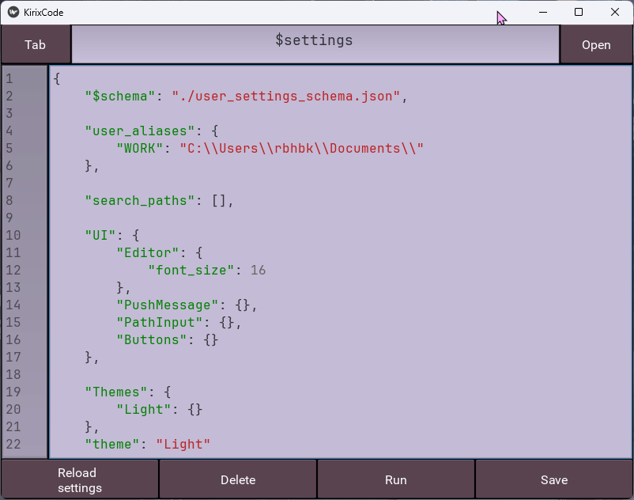

# KirixCodeEditor

##### Редактор кода написан на **[Python](https://www.python.org/) [Kivy](https://www.python.org/)**

### Внешний вид:

### Подсветка синтаксиса для следующих языков программирования (pygments)

### 1. Установка

#### 1.1 Source code

    git clone https://github.com/KiriSol/KirixCodeEditor.git

#### 1.2 Сборка приложения

...

##### <ins>Учитель-куратор</ins>: Нафикова Марина Александровна
