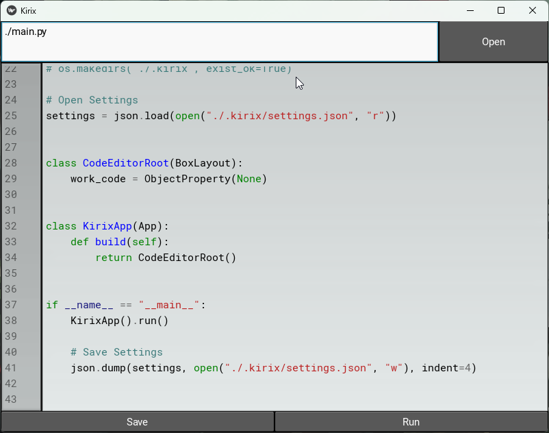

# KirixCodeEditor

!!! some Это практическая часть школьного проекта

##### Редактор кода написан на **[Python](https://www.python.org/) [Kivy](https://www.python.org/)**

### 1. Установка

#### 1.1 Source code
    git clone https://github.com/KiriSol/KirixCodeEditor.git

#### 1.2 Сборка приложения
> См. [releases](Docs/RELEASES.md)

###### <ins>Учитель-куратор</ins>: Нафикова Марина Александровна
